# Dogs R Us

This is a website about a doggy day care and hotel based in cork city in ireland.They provide a range of services from doggy day care to doggy hotel to dog training and dog walking.

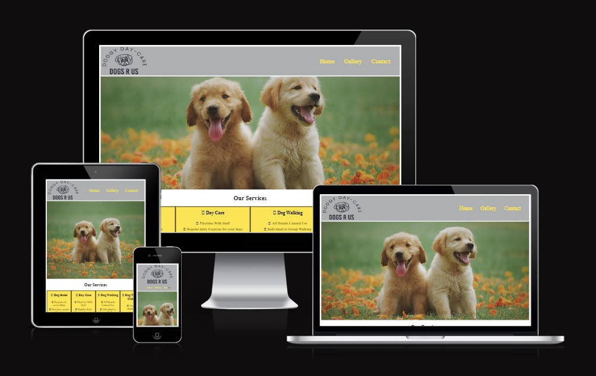

## UX
### User Stories
+ As a user, I want to…
1. be able to navigate the website easily.
2. be able to get the most important information about the doggy day care.
3. be able to see what other services they might offer.
4. be able to contact the company easily and see where they are based.
+ As a site owner, I want…
1.	the information to be clear and informative.
2.	the information to be easily found for the user.
3.	the website be simple to navigate.

## Planning 

I created the wire frames below as a plan layout of how my website should look.

### The Home Page

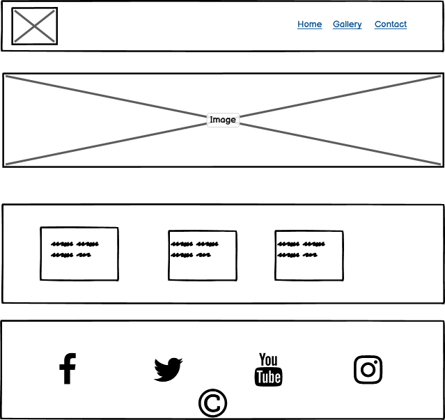

### The Gallery Page

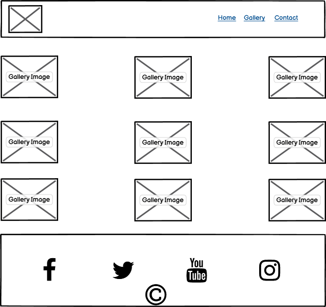

### The Contact Us Page

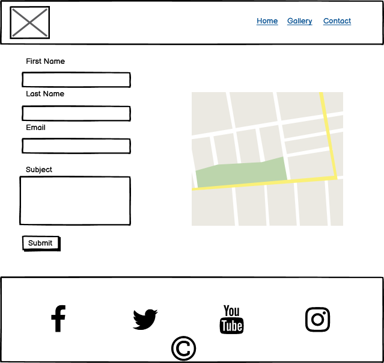

## Features

### Navigation 
- Featured at the top of the page is the navigation bar, i have a logo on the left hand side where i got a free image from plexels.
- The navigations links to the other pages are on the right hand side: Home, Gallery, Contact
- The navigation bar clearly states the name of the website on the left and incudes a dog image so people will know the website is dog related and on the right hand side the page links for easy navigation.  

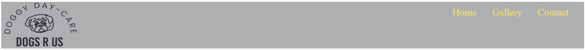

### Hero Image 
- The hero image is a pciture of two labourer dogs playing in the autumn leaves.The picture zooms out as the page is made samller.

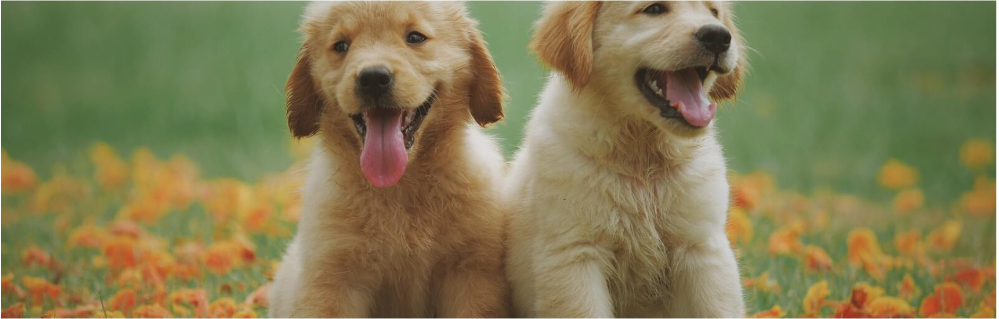

### Services 

- The services boxs list all the different services that are offered through the website. Font awesome is used to generate the font texts.

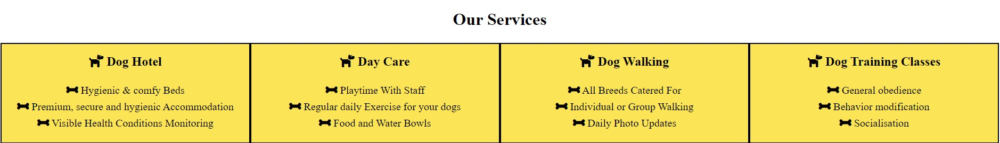

### Footer 
- With the footer we have a link to all our social medias, facebook, twitter, youtube and instagram. Logos are provided by font awesome.
- We also have the copyright year and my name.

### Gallery
- The gallery page lists nine images of dogs from the website pexels.com, all the images are the same size and have been compressed and converted to webp images.
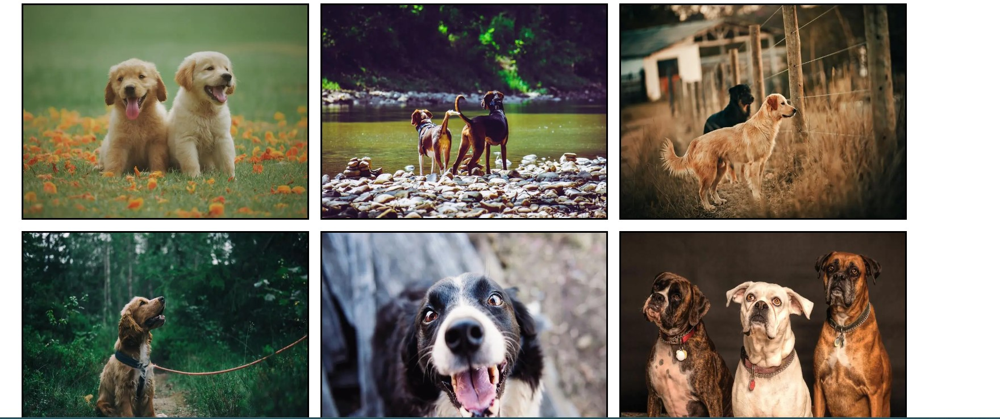

### Contact Us Form
- The contact us form provides a way for the customer to contact the website, it has a first name and last name box, an email box and a text area for writing the subject. It has labels and placeholders.
- There is an iframe with a google map with a location of cork city on it so they customer knows where the comapany is based.
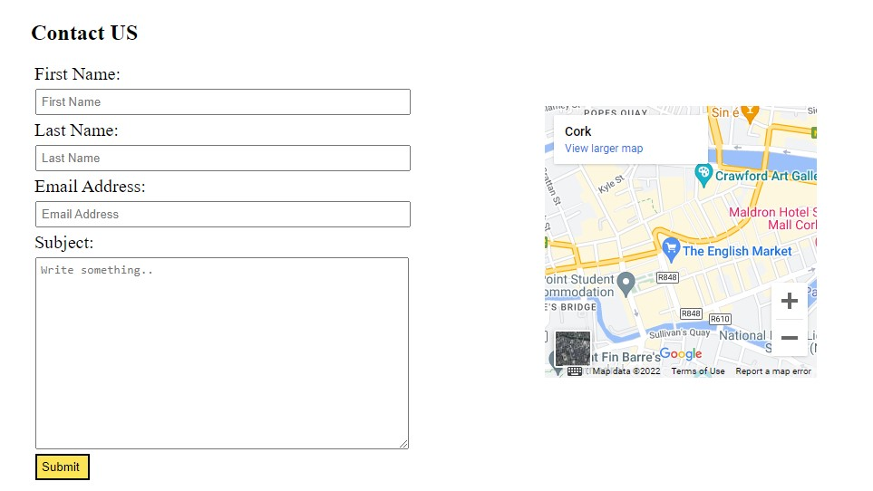

## Testing

### Light House Tests

### Home Page
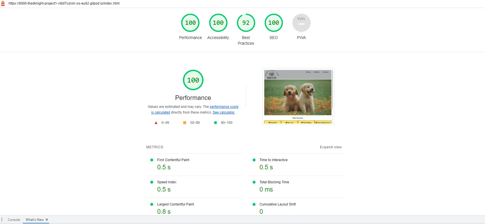

### Gallery Page
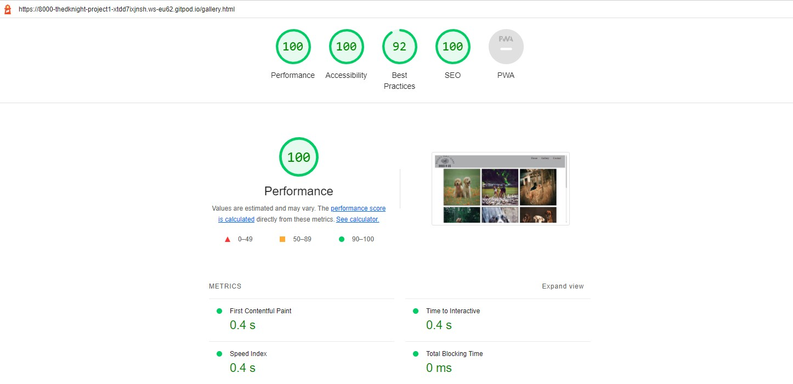

### Contact Us Page 
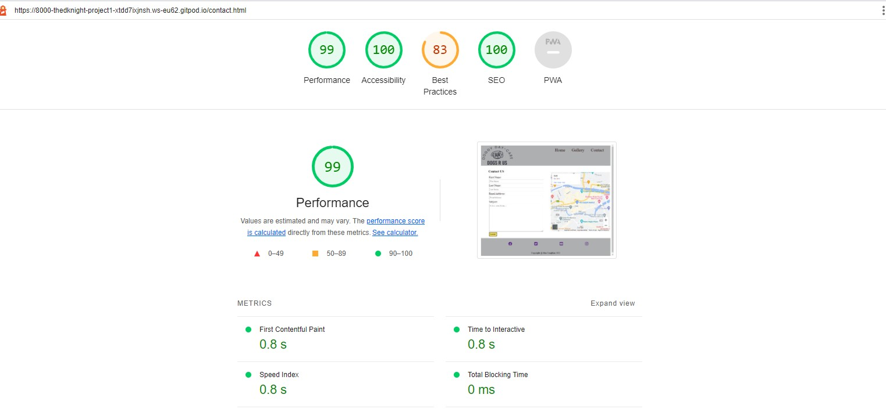

### HTML Testing

- No errors were found during html testings of the three pages.

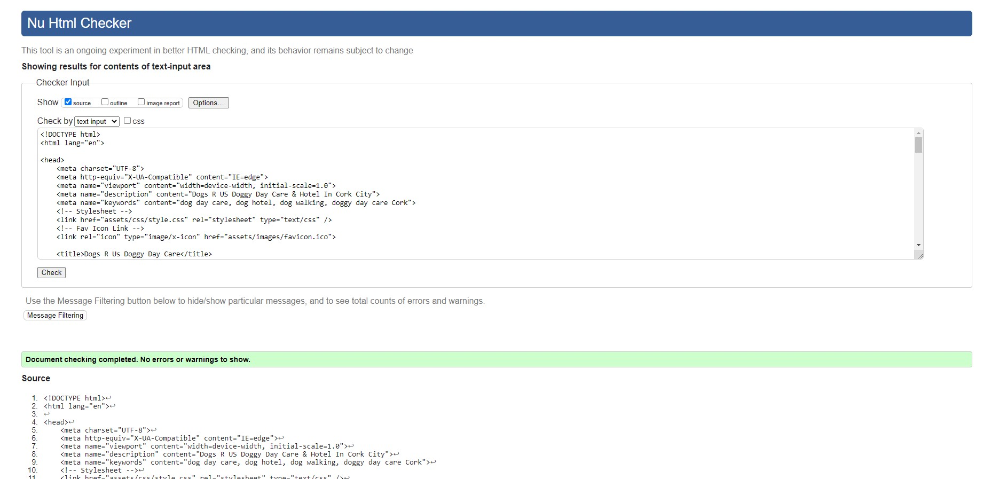
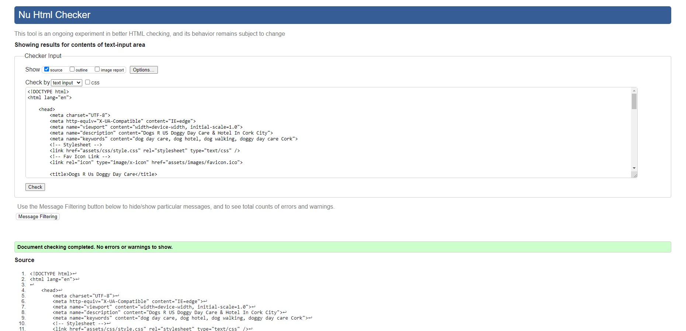
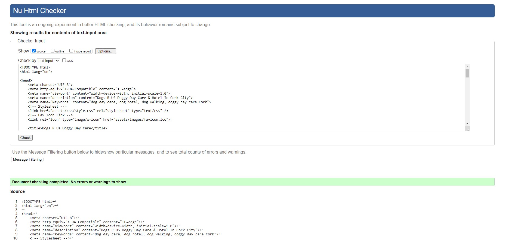

### CSS Testing
 - No errors were found when passing through the official W3C validator.

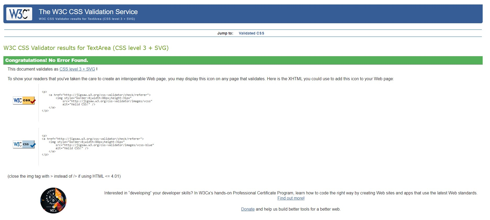

Manual Testing
Desktop
Mozilla Firefox, Google Chrome, Microsoft Edge: everything is working good. Page loads and all of the page features are working.

Mobile
Tested with Ipad air, Iphone SE, Galaxy Fold and iPhone 12. It is responsive as intended.

Chrome Dev Tools
Tested for available devices, webpage works well. It is responsive as intended.

## Errors
- During testing and validation i found an error in the css validator as i was missing a closing tag.
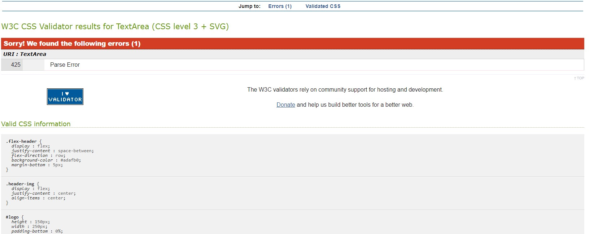

## Deployment 
- The website was deployed to GitHub pages.

- The steps to deploy are as follows:
- In the GitHub repository, navigate to the Settings tab;
- From the source section drop-down menu, select the Master Branch;
 - Once the master branch has been selected, the page will be automatically refreshed with a detailed ribbon display to indicate the successful deployment. The live link can be found here.
### Github
 https://github.com/TheDKnight/project1

### Github Pages 
 https://thedknight.github.io/project1/

 ## Content

### Media
- All pictures and images used in this project are from https://pexels.com.

### Resources 
### Favicon generator. https://favicon.io/
-I used this side to conevert the logo to the 16x16 size for the favicon.

### W3 Schools https://www.w3schools.com/
- Used for variety of tutorials and deeper understanding of some important concepts related to both HTML and CSS. 

### Footer Code
- Love Running sample project footer code - Footer adapted from this code.
